# Database Entity Relationship Diagram

This ERD shows the structure of the group planner database after applying all migrations.

```mermaid
erDiagram
    users ||--o{ groups : "creates"
    users ||--o{ group_members : "belongs to"
    users ||--o{ members : "controls"
    users ||--o{ events : "creates"
    users ||--o{ event_rsvps : "responds to"
    users ||--o{ freeholds : "owns"
    
    groups ||--o{ group_members : "has"
    groups ||--o{ members : "contains"
    groups ||--o{ events : "hosts"
    groups ||--o{ announcements : "posts"
    groups ||--o{ parties : "organizes"
    groups ||--o{ freeholds : "manages"
    groups ||--o{ guild_banks : "operates"
    groups ||--o{ loot_systems : "configures"
    groups ||--o{ caravan_events : "schedules"
    groups ||--o{ siege_events : "participates in"
    groups ||--o{ group_achievements : "unlocks"
    groups ||--o{ activity_log : "tracks"
    groups ||--o{ group_permission_overrides : "customizes"
    groups ||--o{ alliance_members : "joins"
    groups ||--o{ recruitment_applications : "receives"
    
    groups {
        uuid id PK
        text name
        text game
        text group_icon_url
        text group_webhook_url
        text group_welcome_webhook_url
        uuid created_by FK
        timestamptz created_at
    }
    
    users {
        uuid id PK
        text email
        text display_name
        text avatar_url
        timestamptz created_at
    }
    
    group_members {
        uuid id PK
        uuid group_id FK
        uuid user_id FK
        varchar role
        boolean is_creator
        timestamptz applied_at
        timestamptz approved_at
    }
    
    members {
        uuid id PK
        uuid group_id FK
        uuid user_id FK
        varchar name
        text game
        varchar character_class
        varchar rank
        text-array preferred_role
        timestamptz created_at
    }
    
    events {
        uuid id PK
        uuid group_id FK
        uuid created_by FK
        varchar title
        text description
        varchar event_type
        timestamptz starts_at
        timestamptz ends_at
        varchar location
        integer max_attendees
        boolean is_cancelled
    }
    
    event_rsvps {
        uuid id PK
        uuid event_id FK
        uuid user_id FK
        uuid character_id FK
        varchar status
        text note
        timestamptz responded_at
    }
    
    announcements {
        uuid id PK
        uuid group_id FK
        uuid created_by FK
        varchar title
        text content
        boolean is_pinned
        timestamptz created_at
    }
    
    parties {
        uuid id PK
        uuid group_id FK
        text name
        text description
        integer tanks_needed
        integer healers_needed
        integer dps_needed
        integer support_needed
    }
    
    party_roster {
        uuid id PK
        uuid party_id FK
        uuid character_id FK
        text role
        boolean is_confirmed
    }
    
    freeholds {
        uuid id PK
        uuid group_id FK
        uuid owner_id FK
        uuid owner_character_id FK
        varchar name
        varchar node_name
        varchar region
        varchar coordinates
    }
    
    guild_banks {
        uuid id PK
        uuid group_id FK
        varchar name
        text description
        bigint gold_balance
        varchar deposit_min_role
        varchar withdraw_min_role
    }
    
    bank_inventory {
        uuid bank_id FK
        uuid resource_id FK
        integer quantity
        timestamptz last_updated
    }
    
    bank_transactions {
        uuid id PK
        uuid bank_id FK
        uuid resource_id FK
        uuid user_id FK
        varchar transaction_type
        integer quantity
        timestamptz created_at
    }
    
    resource_requests {
        uuid id PK
        uuid bank_id FK
        uuid resource_id FK
        uuid requested_by FK
        integer quantity
        varchar status
        timestamptz created_at
    }
    
    loot_systems {
        uuid id PK
        uuid group_id FK
        varchar system_type
        varchar name
        text description
        boolean is_active
        integer starting_points
    }
    
    dkp_points {
        uuid id PK
        uuid loot_system_id FK
        uuid character_id FK
        integer current_points
        integer lifetime_earned
        integer lifetime_spent
    }
    
    loot_history {
        uuid id PK
        uuid loot_system_id FK
        uuid awarded_to FK
        varchar item_name
        integer dkp_cost
        timestamptz awarded_at
    }
    
    dkp_transactions {
        uuid id PK
        uuid dkp_points_id FK
        varchar transaction_type
        integer amount
        text reason
        timestamptz created_at
    }
    
    caravan_events {
        uuid id PK
        uuid group_id FK
        uuid created_by FK
        varchar title
        varchar caravan_type
        varchar origin_node
        varchar destination_node
        timestamptz starts_at
    }
    
    siege_events {
        uuid id PK
        uuid group_id FK
        varchar title
        varchar siege_type
        varchar target_name
        timestamptz starts_at
        timestamptz declaration_ends_at
    }
    
    group_achievements {
        uuid id PK
        uuid group_id FK
        uuid achievement_id FK
        integer current_value
        boolean is_unlocked
        timestamptz unlocked_at
    }
    
    achievement_definitions {
        uuid id PK
        varchar name
        text description
        varchar category
        integer threshold
    }
    
    achievement_notifications {
        uuid id PK
        uuid group_id FK
        uuid achievement_id FK
        boolean is_sent
        timestamptz sent_at
    }
    
    activity_log {
        uuid id PK
        uuid group_id FK
        uuid user_id FK
        uuid character_id FK
        varchar activity_type
        text description
        timestamptz created_at
    }
    
    member_activity_summary {
        uuid id PK
        uuid group_id FK
        uuid user_id FK
        timestamptz last_login_at
        timestamptz last_activity_at
        integer events_attended_30d
        integer total_activities_30d
        boolean is_inactive
    }
    
    inactivity_alerts {
        uuid id PK
        uuid group_id FK
        uuid user_id FK
        integer days_inactive
        varchar alert_level
        boolean is_acknowledged
    }
    
    group_permission_overrides {
        uuid id PK
        uuid group_id FK
        text role
        boolean characters_create
        boolean characters_read_all
        boolean events_create
        boolean bank_withdraw
    }
    
    alliances {
        uuid id PK
        varchar name
        text description
        uuid leader_group_id FK
    }
    
    alliance_members {
        uuid id PK
        uuid alliance_id FK
        uuid group_id FK
        varchar status
        boolean is_founder
        boolean can_invite
        timestamptz joined_at
    }
    
    alliance_events {
        uuid id PK
        uuid alliance_id FK
        varchar title
        varchar event_type
        timestamptz starts_at
        integer duration_minutes
    }
    
    alliance_event_participation {
        uuid id PK
        uuid event_id FK
        uuid group_id FK
        integer confirmed_count
        text notes
    }
    
    recruitment_applications {
        uuid id PK
        uuid group_id FK
        uuid user_id FK
        text discord_username
        text character_name
        text primary_class
        varchar status
        timestamptz created_at
    }
    
    builds {
        uuid id PK
        uuid created_by FK
        uuid group_id FK
        varchar name
        text description
        text game
        varchar character_class
        text build_data
    }
    
    member_professions {
        uuid id PK
        uuid member_id FK
        varchar profession
        integer level
    }
    
    events ||--o{ event_rsvps : "has responses"
    members ||--o{ member_professions : "has skills"
    members ||--o{ party_roster : "assigned to"
    members ||--o{ dkp_points : "earns"
    members ||--o{ loot_history : "receives loot"
    
    parties ||--o{ party_roster : "contains"
    
    guild_banks ||--o{ bank_inventory : "stores"
    guild_banks ||--o{ bank_transactions : "logs"
    guild_banks ||--o{ resource_requests : "processes"
    
    loot_systems ||--o{ dkp_points : "tracks"
    loot_systems ||--o{ loot_history : "records"
    
    dkp_points ||--o{ dkp_transactions : "modified by"
    
    achievement_definitions ||--o{ group_achievements : "unlocked by"
    achievement_definitions ||--o{ achievement_notifications : "notifies"
    
    alliances ||--o{ alliance_members : "includes"
    alliances ||--o{ alliance_events : "hosts"
    
    alliance_events ||--o{ alliance_event_participation : "tracked by"
```

## Key Relationships

### Core Structure

* **groups** (formerly clans) - The central entity representing groups/clans
* **users** - Application users (account holders)
* **group\_members** - Junction table linking users to groups with roles
* **members** - Game characters belonging to groups

### Social Features

* **events** - Group calendar events
* **event\_rsvps** - Member responses to events
* **announcements** - Group announcements
* **parties** - Pre-defined party templates
* **party\_roster** - Character assignments to parties

### Economic System

* **guild\_banks** - Group bank configuration
* **bank\_inventory** - Resources stored in bank
* **bank\_transactions** - History of deposits/withdrawals
* **resource\_requests** - Member requests for resources

### Loot Management

* **loot\_systems** - DKP/loot council configuration per group
* **dkp\_points** - Point totals for each character
* **loot\_history** - Items awarded and their costs
* **dkp\_transactions** - Point adjustments and reasons

### Group Activities

* **caravan\_events** - Trade caravan scheduling
* **siege\_events** - Castle/node siege planning
* **freeholds** - Member freehold directory

### Achievement System

* **achievement\_definitions** - Global achievement templates
* **group\_achievements** - Achievements unlocked by groups
* **achievement\_notifications** - Discord notifications queue

### Activity Tracking

* **activity\_log** - All group activities
* **member\_activity\_summary** - Aggregated activity metrics
* **inactivity\_alerts** - Notifications for inactive members

### Alliance System

* **alliances** - Multi-group alliances
* **alliance\_members** - Groups in alliance
* **alliance\_events** - Cross-alliance events
* **alliance\_event\_participation** - Group participation tracking

### Other Features

* **recruitment\_applications** - Public recruitment system
* **group\_permission\_overrides** - Custom role permissions per group
* **builds** - Shared character builds library
* **member\_professions** - Character crafting professions

## Multi-Game Support

The system supports multiple games through:

* `groups.game` - Game identifier (e.g., 'ashes-of-creation', 'starcitizen')
* `members.game` - Character's game context
* `builds.game` - Build's target game

Game-specific data is stored in the `build_data` JSONB field and interpreted based on the game type.
